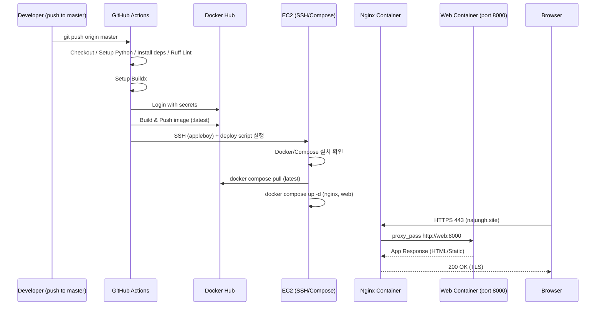

# project-portfolio

개인 포트폴리오 사이트

### 1) 컴포넌트/데이터 흐름 다이어그램

```mermaid
flowchart LR
    subgraph Dev["GitHub Repository (master)"]
      SRC["Code + Dockerfile + requirements.txt + workflow.yml"]
    end

    subgraph CI["GitHub Actions - Job: build-and-push"]
      CHECKOUT["actions/checkout@v4<br/>소스 체크아웃"]
      PY["setup-python@v5<br/>Python 3.11"]
      PIP["pip install -r requirements.txt"]
      LINT["ruff check ."]
      BUILDX["docker/setup-buildx-action@v3"]
      DH_LOGIN["docker/login-action@v3<br/>Docker Hub 로그인 (secrets)"]
      BUILD_PUSH["docker/build-push-action@v5<br/>이미지 빌드 & push: latest"]
    end

    subgraph REG["Docker Hub Registry"]
      IMAGE["${DOCKERHUB_USERNAME}/najungh_portfolio:latest"]
    end

    subgraph CD["GitHub Actions - Job: deploy"]
      SSH["appleboy/ssh-action@master<br/>EC2 접속 & 배포 스크립트 실행"]
    end

    subgraph EC2["EC2 (Ubuntu)"]
      subgraph Docker["Docker Engine + Compose v2"]
        NET["External Network: appnet"]
        subgraph Stack["Compose Stack: docker-compose.prod.yml"]
          NGINX["nginx:1.27-alpine<br/>ports 80/443 → 컨테이너 80/443"]
          WEB["najungh_web<br/>expose 8000"]
        end
      end
      subgraph FS["호스트 파일시스템"]
        CONF["./nginx/conf.d (Nginx vhost)"]
        STATIC["./staticfiles → /wishfast/staticfiles (ro)"]
        LETS["/etc/letsencrypt (ro)"]
      end
    end

    subgraph CA["Let's Encrypt (사전 발급됨)"]
      CERT["fullchain.pem / privkey.pem / dhparams.pem"]
    end

    subgraph User["End User"]
      BROWSER["브라우저 (https://najungh.site)"]
    end

    %% Edges
    SRC --> CHECKOUT --> PY --> PIP --> LINT --> BUILDX --> DH_LOGIN --> BUILD_PUSH --> IMAGE
    IMAGE -. pull .-> SSH
    SSH --> EC2
    EC2 -. "docker compose pull/up -d" .-> IMAGE

    NGINX --- NET
    WEB --- NET

    CONF --> NGINX
    STATIC --> NGINX
    LETS --> NGINX
    CA --> LETS

    BROWSER -->|443/TLS| NGINX -->|proxy_pass :8000| WEB
```

------

### 2) 배포 시퀀스 다이어그램 (엔드투엔드)

```mermaid
sequenceDiagram
    participant Dev as Developer (push to master)
    participant GA as GitHub Actions
    participant DH as Docker Hub
    participant EC2 as EC2 (SSH/Compose)
    participant Nginx as Nginx Container
    participant Web as Web Container (port 8000)
    participant User as Browser

    Dev->>GA: git push origin master
    GA->>GA: Checkout / Setup Python / Install deps / Ruff Lint
    GA->>GA: Setup Buildx
    GA->>DH: Login with secrets
    GA->>DH: Build & Push image (:latest)
    GA->>EC2: SSH (appleboy) + deploy script 실행
    EC2->>EC2: Docker/Compose 설치 확인
    EC2->>DH: docker compose pull (latest)
    EC2->>EC2: docker compose up -d (nginx, web)
    User->>Nginx: HTTPS 443 (najungh.site)
    Nginx->>Web: proxy_pass http://web:8000
    Web-->>Nginx: App Response (HTML/Static)
    Nginx-->>User: 200 OK (TLS)
```
